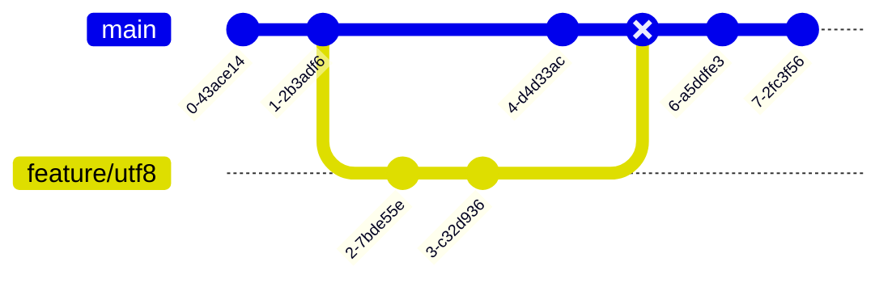
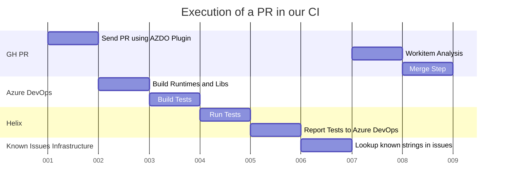
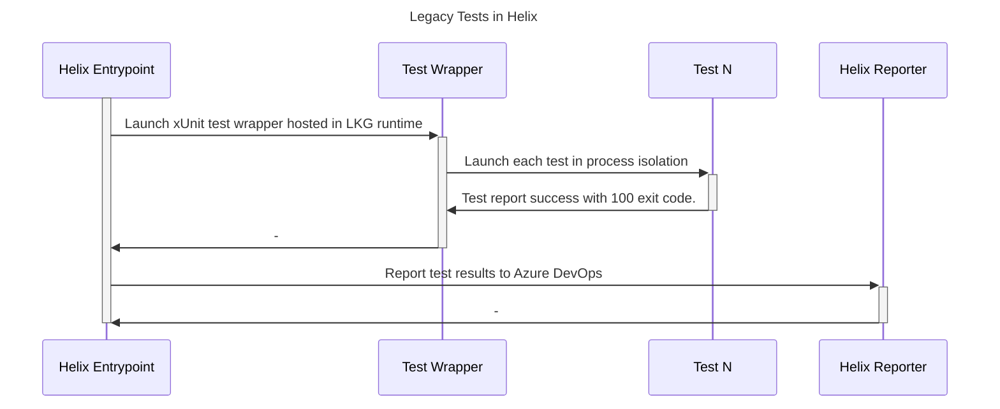
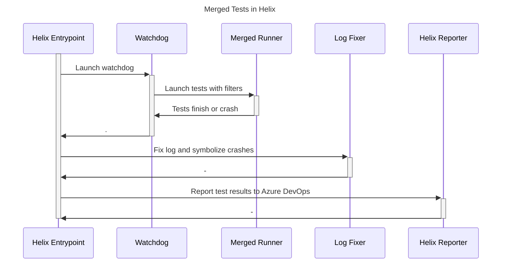

# Обзор пайплайнов - архитектура различных пайплайнов

Репозиторий включает в себя большое количество пайплайнов для валидации. Такие пайплайны помогают оценивать качество продукта в различных сценариях. Некоторые из них запускаются автоматически, а некоторые — по запросу, чтобы учесть доступность оборудования и другие ограничения ресурсов. Работа с пайпланами впрочем остается неизменной.

Предположим, что существует PR из ветки `feature/utf8` в ветку `main`. Плагин `Azure DevOps Pipeline` возьмет мердж-коммит в `main` и поставит в очередь все стандартные пайплайны, а также любые другие запрашиваемые пайплайны в `Azure DevOps`.

Каждый пайплайн создаст собственные сборки runtime, соберет тесты и в конечном итоге запустит их. Обычно тесты запускаются в отдельной среде, которая называется `Helix`. Эта система позволяет распределять большое количество тестов по широкому спектру поддерживаемых платформ. Как только каждая рабочая машина обработает свои результаты, они отправляются обратно в `Azure DevOps` и становятся доступными на вкладке тестов сборки.

## Пайплайны в dotnet/runtime

Репозиторий содержит несколько версий runtime и широкий спектр поддерживаемых библиотек и систем. Эта сложность затрудняет балансирование использования ресурсов, охвата тестирования (test coverage) и продуктивности разработчиков. Чтобы сделать процессы сборки надежными и минимизировать время, затрачиваемое на тестирование изменений, которые вносятся в PR, имеются различные пайплайны — некоторые обязательные, некоторые опциональные. Вы можете перечислить доступные пайплайны, добавив комментарий вроде `/azp list` в PR, или получить доступные команды, добавив комментарий вроде `/azp help`.

Большинство пайплайнов используют собственный механизм для оценки путей на основе изменений, содержащихся в PR, чтобы запустить сборку/тесты с минимальными возможными ресурсами без ущерба для качества. Такие механизма запускаются прежде всего в каждом пайплайне, который зависит от инфраструктуры "Evaluate Paths". На этом шаге можно увидеть результат оценки для каждого подмножества репозитория. Для получения более подробной информации о таких подмножествах см. [в этом документе](https://github.com/vitacore-company/runtime/blob/main/eng/pipelines/common/evaluate-default-paths.yml). Также, чтобы понять, как работает этот механизм cм. [этот документ](https://github.com/vitacore-company/runtime/blob/main/eng/pipelines/common/evaluate-changed-paths.yml).

### Пайплайн runtime

Это "основной" пайплайн для runtime. В этом пайплайне включены самые важные тесты и платформы, на которых должно быть достаточно ресурсов для тестирования, чтобы предоставить результаты в разумные сроки. Тесты пайплайна для runtime и библиотек считаются внутриацикличными (inner loop). Такие тесты выполняются локально, когда разработчик запускает тесты на своем компьютере.

Для мобильных платформ и WebAssembly запускаются smoke-тесты, которые обеспечивают качество этих платформ. Подход со smoke-тестами был вызван из-за ограничений по времени и оборудованию.

### Пайплайн runtime-dev-inner loop

Этот пайплайн также является обязательным. Его цель — охватить сценарии внутреннего цикла разработчика, которые могут быть затронуты любыми изменениями, такими как выполнение конкретной команды сборки или запуск тестов в Visual Studio и т.д.

### Тесты dotnet-linker

Еще обязательный пайплайн. Цель этого пайплайна — обеспечить совместимость кода библиотек и ILLink. Это означает, что когда мы обрезаем наши библиотеки с помощью ILLink, у нас не возникает ошибок (например, случайное удаление необходимого метода).

### Runtime-extra-platforms

Этот пайплайн не запускается по умолчанию, так как он не является обязательным для PR, но он запускается дважды в день и также может быть вызван в PR с помощью комментария `/azp run runtime-extra-platforms`. Этот пайплайн является важной частью тестирования.

Этот пайплайн выполняет тесты внутреннего цикла на платформах, где может быть недостаточно аппаратных ресурсов для запуска тестов (мобильные устройства, браузеры) или на платформах, где тесты должны проходить органически на основе охвата, который имеется в "основном" пайплайне runtime. Например, в основном пайплайне запускаются тесты на Ubuntu 21.10. Поскольку также поддерживается и Ubuntu 18.04 (LTS-версии), в этом пайплайне запускаются тесты на Ubuntu 18.04.

Этот пайплайн также выполняет тесты для стабильных платформ, но для включения их в главный пайплайн runtime недостаточно аппаратных ресурсов. Например, при запуске тестов библиотек для Windows arm64 в этом пайплайне может быть недостаточно аппаратных ресурсов для запуска JIT-тестов и тестов библиотек для Windows arm64 на каждом PR. JIT — это самый важный элемент для тестирования, так как именно он генерирует нативный код для выполнения на этой платформе. Поэтому JIT-тесты на arm64 запускаются только в "основном" пайплайне, в то время как тесты библиотек выполняются только в пайплайне `runtime-extra-platforms`.

### Пайплайны внешнего цикла

В репозитории имеются различные пайплайны, в названии которых содержится тэг `Outerloop`. Такие пайплайны не запускаются по умолчанию на каждом PR, но их также можно вызвать с помощью комментария `/azp run`. Они будут запускаться ежедневно для анализа результатов тестирования.

Эти пайплайны выполняют тесты, которые требуют длительного времени. Такие тесты также не очень стабильны (например, сетевые тесты), а также изменяют состояние машины.

## Запуск тестов runtime тестов и управление Helix

### Legacy-тесты

В старых тестах runtime классический консольный тестировщик **xUnit** запускает сгенерированный набор фактов xUnit. Каждый факт вызывает оболочку/пакетный скрипт, который настраивает окружение, а затем запускает консольные приложения, которые составляют тестовую среду runtime. Обертка (wrapper) также отвечает за сбор всех выходных данных из запущенных процессов. Основное преимущество этого метода заключается в том, что каждый тест запускается в изоляции от процессов. Это позволяет xUnit и его дочернему процессу иметь разные версии runtime, что защищает тесты от нативных сбоев. Обычный рабочий процесс в Helix для этого типа выглядит следующим образом:

### Тестирование с помощью SourceGen

Консолидированные тесты runtime создают точки входа ассемблера во время сборки. Генерация исходного кода собирает тесты, которые будут запущены, а также создает метод `Main`, который выполняет каждый тест в блоке `try`/`catch` и захватывает все необходимые выходные данные. Есть несколько тестов, которые требуют изоляции. То есть вместо вызова таких тестов в процессе запускается другой необходимый процесс. Основное преимущество такого подхода заключается в том, что он меньше зависит от изоляции процессов, что делает тестирование гораздо дешевле. Это также означает, что первое необработанное исключение, как нативное, так и управляемое, приостановит все тесты — аналогично тому, что происходит с тестами библиотек. Тестировщик, который последовательно вызывает тесты, работает под контролем системы наблюдения (watchdog), чтобы обрабатывать зависания. После этого запускается лог-фиксер, который исправляет поврежденные логи в случае сбоя, чтобы Helix мог предоставить как можно больше информации о прогрессе. Работа Helix для этого типа выглядит следующим образом:

